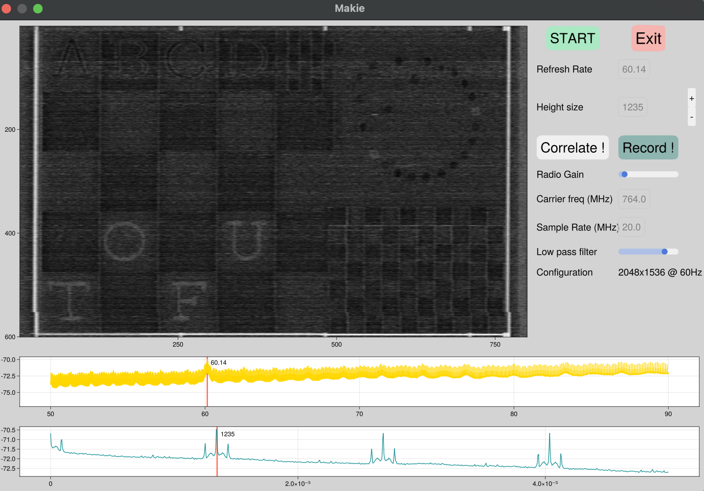

# TempestSDR.jl 

{ width=80% }

This package proposes a Graphical User Interface (GUI) to perform real time screen eavesdrop.

The GUI is build using [Makie](https://docs.makie.org/stable/) and helps to find the screen leakage and to extract the remote screen configuration that is used. This application is inspired by the amazing work of Marinov proposed in open source in the [TempestSDR project](https://github.com/martinmarinov/TempestSDR) 

This package should be used with a Software Defined Radio (SDR) that receives Electromagnetic signal and samples it. This package is build on top of [AbstractSDRs](https://github.com/JuliaTelecom/AbstractSDRs.jl) to propose automatic configuration of the SDR. 

The application works as follows 
- Configure a SDR on a given carrier frequency and given bandwidth (typically 20MHz). The chosen carrier frequency has to be a multiple of a HDMI//VGA norm and are often multiple of 148,5MHz 
- Propose useful iterative metrics in order to find the appropriate screen configuration (refresh rate, size) 
- Renderer in real time the grayscale image associated to the captured signal. If the chosen carrier frequency matches a side channel leakage, an image of the screen will appear !   

Note that the GUI can also be used as a post processing application fed by a binary file in which a signal has been pre-recorded by a SDR (for instance through GNURadio recording).

## What is a screen Eavesdrop ? 

TEMPEST SDR (Software-Defined Radio) refers to a type of radio system that is designed to capture and analyze electromagnetic emissions, including radio signals, that are unintentionally generated by electronic devices, such as computers, monitors, keyboards, or other equipment.

The term "TEMPEST" originally referred to a U.S. government codename for a program that studied and developed methods for protecting against such unintentional electromagnetic emissions, which can potentially leak information and be intercepted by unauthorized parties. 

SDR are a precious tool for passive eavesdrop. By listening to the electromagnetic radiation of an electronic device, one can find hidden information passively (or actively) emitted. If you are interest in this theme, you can have a look on [a survey we made on this precise topic](https://hal.science/hal-03176249).

Screen are connected to devices by cables, often HDMI or VGA. This can lead to an unwanted emission of the image signal through electromagnetic wave. A passive listener can retrieve the image signal without be in the same room of the targeted PC !    

A simple Video example done without any modification of the eavesdropped PC! 

## How it works 

First, you have to install the package through package manager 

        julia> using Pkg 
        julia> Pkg.add("TempestSDR")

Or directly `] add TempestSDR` in the Pkg mode of the Julia REPL. There are a bunch a dependencies so it makes take a little time to install. 

Then after some black magic Pkg does you should be able to launch the graphical user interface with this command 

        julia> using TempestSDR 
        julia> TempestSDR.gui(; sdr = :radiosim,
        carrierFreq = 764e6,
        sampingRate=20e6, 
        gain = 20,
        )                  

Some remarks here 
- `sdr` keyword corresponds to  the type of SDR you use and have to be supported by AbstrctSDRs. If you want to use some binary file, set the sdr as `radiosim` which is the virtual radio front-end used in AbstractSDRs 
- `carrierFreq` is the carrier frequency of the SDR and should be tuned to a potential leakage (for instance  742.5 MHz) 
- `samplingRate` is the band of the SDR. The larger is ofen the better and we find that 20MHz is a very good trade-off. If your SDR does not support this bandwidth try lower values (with often lower image reconstruction)
- `gain` is the gain of the radio. If you don't know how what to put, try a value of 0 and do not hesitate to increase it :) 
- `buffer::Vector{ComplexF32}` (optional) if you want to provide the GUI samples you have already acquire. It has only a sense if you use a virtual backend `radiosim` (otherwise samples from SDR will be used).

## How the GUI works 

The GUI can be launched with 

        using TempestSDR 
        tup = gui(;sdr=:radiosim,carrierFreq=764e6,samplingRate=20e6,gain=9,acquisition=0.05);
        

{ width=60% }

If you use `:radiosim` SDR backend without specifying the vector of the raw data, it will use by default the test samples provided by the project. It can render an image so it is perfect to learn how to configure the GUI ! 

When you open the GUI, several panels are present. In particular, one is dedicated to the image rendering while the others are for the configuration (of the SDR, or panel to select the screen resolution through correlations).
The correlations can be used to find the best configuration and are interactive. The key is to select peak of correlations !   

 - The first correlation is used the find the screen rate (By selecting the peak) 
 - The second correlation can be used to find the number of lines of the screen. Based on this number of screen configuration can be isolated (there are limited configurations for given rate and number of lines !) 

By selecting the best configuration (peaks on the 2 correlation panels), the associated screen resolution will be updated on the left panel. You can slightly modify the number of lines (with the + and the -) to scale and synchronize the rendering image. 

Tuning the low pass coefficient (the larger the smoother the image is) can also help to increase the image rendering.

When you have a good image rendering, you can also store the raw IQ samples by clicking on the button record. You can typically obtain a renderer image as this one 

{ width=60% }

In this configuration (this is with the default file), you have manage to capture a remote screen that works at 60.14Hz, with a screen configuration of 2048x1536. You can see the content of the screen and also letters that are very difficult to see.

If you use a real SDR and change the position of the antenna, you can force to recalculate the correlation by clicking on the `correlate` button. 

## Using a real SDR for a real eavesdrop 

The command 

        using TempestSDR 
        tup = gui(;sdr=:radiosim,carrierFreq=764e6,samplingRate=20e6,gain=9,acquisition=0.05);

uses a virtual radio populated by the given signal (which has a screen eavesdrop inside).

While it is a first try, the real interest lies when a real SDR is used, by trying to intercept a real screen. 

What you need to do this ?

- A SDR supported by AbstractSDRs (an USRP, a BladeRF or a Pluto). If you have an SDR that is not supported by any AbstractSDRs backend, feel free to open a PR on AbstractSDRs 

- A setup to attack: a PC (laptop or tower) connected to a screen by a VGA or HDMI cable. First, position your SDR near to the PC to attack in order to enhance the received Signal to Noise Radio (SNR). After you have obtain an image, you can move the SDR far from the attacked PC.  

Then, launch the GUI by setting the proper SDR backend. For instance if you use an AdalmPluto from Analog device, you can run

        using TempestSDR 
        tup = gui(;sdr=:pluto,carrierFreq=764e6,samplingRate=20e6,gain=9,acquisition=0.05);

Note that you can add any specific keywords associated to the radio configuration such as the address of the SDR 

        using TempestSDR 
        tup = gui(;sdr=:pluto,carrierFreq=764e6,samplingRate=20e6,gain=9,acquisition=0.05,addr="usb:1.0.5");

You have to tune the carrier frequency to find a potential leakage. When choosing a carrier frequency, remain to important things  

- Leakage appears at multiple  of screen clock (often multiple of 148,5MHz ) 
- If you detect EM activities, the correlation should have variations. If you encounter many peaks, this is a good sign as it means that this EM  signature has patterns   

## Why TempestSDR in pure Julia ?

There are several implementation proposed for TempestSDR such as the one proposed initially by Marinov. Most of them falls into the 2 language problem. 

- The GUI part and the interface are often written in high level language (such as Java) 

- The processing part is often written in low level language as the proxying requires real time processing with computational intensive processing. For instance, finding the configuration requires lot of autocorrelation and the frame synchronisation requires a O(n^2) complexity with n the size of the width and the heigh.   

This is a project that both 

- Exhibits the power of Julia language as the same algorithms has been used for prototyping (find screen leakage in my lab) and for the final application 

- Demonstrate the interest of side channel analysis in research project ([French ANR RedInBlack](https://files.inria.fr/redinblack/))

## Precompilation notes

One key issue with the application is the initial latency caused by the initial pre-compilation. There are probably some inference issue that can be solved by updating the code (any PR are welcome 😀) but in the meantime speeding up the application can also be of interest.

A simple way is to use the wonderful [Package Compiler application](https://github.com/JuliaLang/PackageCompiler.jl). The goal is to generate a (massive) shared library that can be used in the Julia startup to remove almost all the pre-compilation time. 
If you want to bring the recompilation speed for TempestSDR.jl, use the  following steps 

In the current directory create a file `script_gui.jl` with the following content 

    using TempestSDR 
    tup = gui(;sdr=:radiosim,carrierFreq=764e6,samplingRate=20e6,gain=9,acquisition=0.05);
            

Add Package Compiler as a dependency of your default environment (or create a sandbox environment using a temporary environment)

        julia> using PackageCompiler 
        julia> create_sysimage(["TempestSDRs"], sysimage_path="sys_tempestsdr.so", precompile_execution_file="script_gui.jl")

It will take some time and finally generate a shared library `sys_tempestsdr.so`. You can launch now julia with the pre-compilation option as 

        julia -t auto --sysimage sys_tempestsdr.so

## Greetings 

This work is funded by DGA and Brittany region under the Creach Lab founding and by the French National Research Agency (ANR) under the grant number ANR-22-CE25-0007-01 (RedInBlack project).
