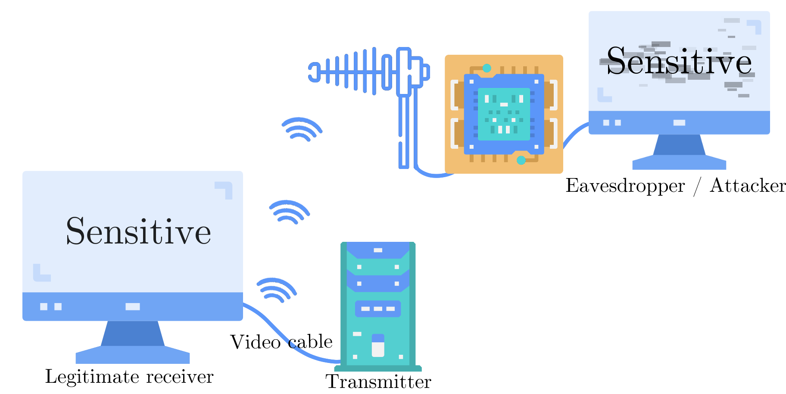

# TempestSDR.jl

## 🚀 Objectives

This package proposes a Graphical User Interface (GUI) to perform real time screen eavesdrop.

The GUI is build using [Makie](https://docs.makie.org/stable/) and helps to find the screen leakage and to extract the remote screen configuration that is used. This application is inspired by the amazing work of Marinov proposed in open source in the [TempestSDR project](https://github.com/martinmarinov/TempestSDR) 

This package should be used with a Software Defined Radio (SDR) that receives Electromagnetic signal and samples it. This package is build on top of [AbstractSDRs](https://github.com/JuliaTelecom/AbstractSDRs.jl) to propose automatic configuration of the SDR. 

## 👀 What is a screen Eavesdrop ? 

TEMPEST SDR (Software-Defined Radio) refers to a type of radio system that is designed to capture and analyze electromagnetic emissions, including radio signals, that are unintentionally generated by electronic devices, such as computers, monitors, keyboards, or other equipment.

The term "TEMPEST" originally referred to a U.S. government codename for a program that studied and developed methods for protecting against such unintentional electromagnetic emissions, which can potentially leak information and be intercepted by unauthorized parties. 

SDR are a precious tool for passive eavesdrop. By listening to the electromagnetic radiation of an electronic device, one can find hidden information passively (or actively) emitted. If you are interest in this theme, you can have a look on [a survey we made on this precise topic](https://hal.science/hal-03176249).

Screen are connected to devices by cables, often HDMI or VGA. This can lead to an unwanted emission of the image signal through electromagnetic wave. A passive listener can retrieve the image signal without be in the same room of the targeted PC !    

A simple Video example done without any modification of the eavesdropped PC! 

## 🔒 Use Cases and Security Considerations

TempestSDR facilitates passive eavesdropping by capturing and analyzing unintentional electromagnetic emissions. It serves as a valuable tool for security researchers, enabling the detection and exploration of potential side channel vulnerabilities. **However, it's essential to respect privacy and legal boundaries. Ensure you have proper authorization and adhere to legal and ethical guidelines when using TempestSDR.**

## 📖 Documentation 

- [**STABLE**](https://juliatelecom.github.io/TempestSDR.jl/dev/index.html) &mdash; **documentation of the most recently tagged version.**

## 💰 Greetings 

This work is funded by DGA and Brittany region under the Creach Lab founding and by the French National Research Agency (ANR) under the grant number ANR-22-CE25-0007-01 ([RedInBlack project](https://files.inria.fr/redinblack/).
