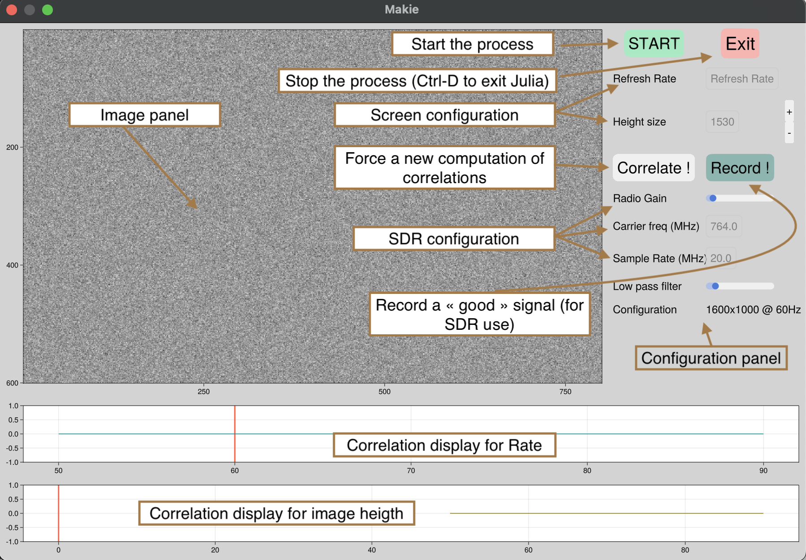

## How the GUI works 

The GUI can be launched with 

        using TempestSDR 
        tup = gui(;sdr=:radiosim,carrierFreq=764e6,samplingRate=20e6,gain=9,acquisition=0.05);
        

If you use `:radiosim` SDR backend without specifying the vector of the raw data, it will use by default the test samples provided by the project. It can render an image so it is perfect to learn how to configure the GUI ! 

When you open the GUI, several panels are present. In particular, one is dedicated to the image rendering while the others are for the configuration (of the SDR, or panel to select the screen resolution through correlations).
The correlations can be used to find the best configuration and are interactive. The key is to select peak of correlations !   

 - The first correlation is used the find the screen rate (By selecting the peak) 
 - The second correlation can be used to find the number of lines of the screen. Based on this number of screen configuration can be isolated (there are limited configurations for given rate and number of lines !) 

By selecting the best configuration (peaks on the 2 correlation panels), the associated screen resolution will be updated on the left panel. You can slightly modify the number of lines (with the + and the -) to scale and synchronize the rendering image. 

Tuning the low pass coefficient (the larger the smoother the image is) can also help to increase the image rendering.

When you have a good image rendering, you can also store the raw IQ samples by clicking on the button record. You can typically obtain a renderer image as this one 

In this configuration (this is with the default file), you have manage to capture a remote screen that works at 60.14Hz, with a screen configuration of 2048x1536. You can see the content of the screen and also letters that are very difficult to see.

If you use a real SDR and change the position of the antenna, you can force to recalculate the correlation by clicking on the `correlate` button. 

